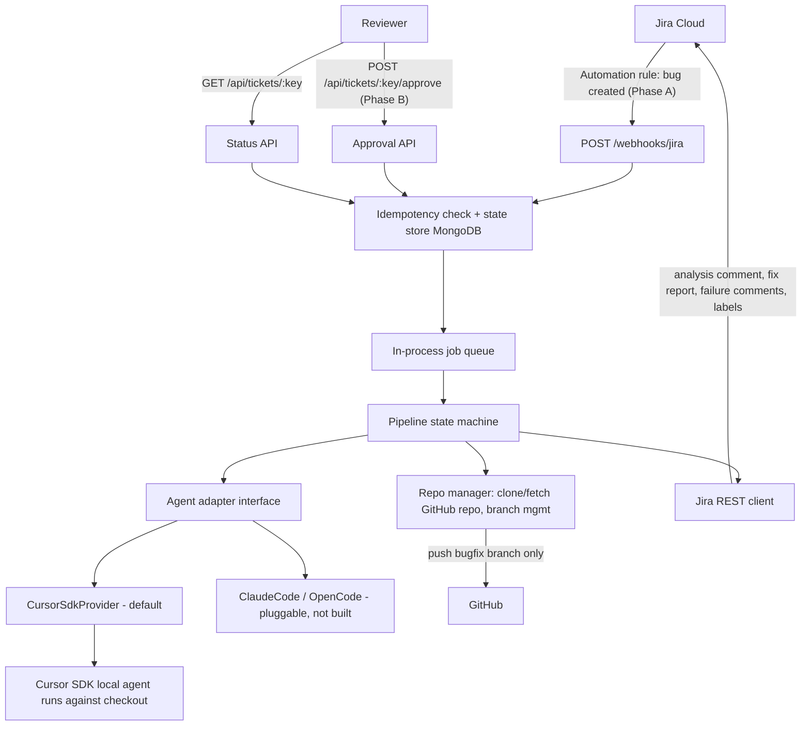

# Jira AI Bugfix Pipeline

An automated bug-fixing pipeline: when a bug is created in Jira, an AI coding agent analyzes it (read-only), posts a structured root-cause report back to the ticket, and pauses. After a human reviews and approves the analysis via a REST API call, the agent implements the fix on a dedicated `bugfix/<TICKET-ID>-<slug>` branch, backs it with tests, and pushes the branch. Merging stays fully manual.

## Architecture



### Pipeline state machine (persisted per ticket in MongoDB)

```
RECEIVED -> ANALYZING -> AWAITING_APPROVAL -> FIXING -> TESTING -> DELIVERED
```

`FAILED` is reachable from any active state and always reports back to Jira (comment + `ai-fix-failed` label). A `FAILED` ticket resets to `RECEIVED` when the webhook fires again, so re-triggering is safe. Every transition is recorded in the append-only `audit_log` collection.

### Two-phase workflow

**Phase A — Analysis (automatic, read-only).** The mapped repo is cloned/fetched into a work directory and put on a pristine base branch. The agent investigates and writes a JSON `AnalysisReport` to `.pipeline/analysis-report.json`, which is schema-validated, stored, and posted to the ticket as a formatted comment (label: `ai-analysis-ready`). Read-only is enforced twice: the prompt forbids edits, and the orchestrator reverts and logs any dirty state afterwards. The pipeline then pauses in `AWAITING_APPROVAL`.

**Phase B — Fix (human-gated).** Triggered by `POST /api/tickets/:issueKey/approve`. The orchestrator creates `bugfix/<TICKET-ID>-<slug>` from the configured base branch (default `beta`), or resumes the existing remote branch if a prior run died mid-flight. The agent implements the approved fix plus tests. The orchestrator then **independently** runs the project's test command — the agent's word is never trusted — computes the real diff, commits leftovers, and only on green tests pushes the branch and posts the `FixReport` to Jira (label: `ai-fix-delivered`). If tests fail, the branch is not pushed and the failure (with test output) is reported (label: `ai-fix-failed`).

### Human-controlled steps (out of scope by design)

Merging follows the manual promotion chain `bugfix branch -> release branch -> beta release -> beta -> prod release -> main`. This service never opens PRs and never writes to any branch except the bugfix branch it pushes. A future `PromotionService` would plug in right after the `DELIVERED` transition in [apps/bugfix/src/pipeline/phaseB.ts](../apps/bugfix/src/pipeline/phaseB.ts).

## Provider abstraction

Adapters implement one contract ([apps/bugfix/src/providers/types.ts](../apps/bugfix/src/providers/types.ts)):

```typescript
interface AgentProvider {
  readonly name: string;
  analyze(
    task: BugTask,
    ctx: RepoContext,
    hooks: RunHooks,
  ): Promise<AnalysisReport>;
  fix(
    task: BugTask,
    ctx: RepoContext,
    approved: AnalysisReport,
    hooks: RunHooks,
  ): Promise<FixOutcome>;
}
```

The default is `CursorSdkProvider` ([apps/bugfix/src/providers/cursor.ts](../apps/bugfix/src/providers/cursor.ts)), which uses the shared `CursorAgentRunner` from `@ai-auto/providers` against the checkout and extracts structured output from a report file the agent writes. To add Claude Code, OpenCode, etc., implement the interface and register a factory in [apps/bugfix/src/providers/registry.ts](../apps/bugfix/src/providers/registry.ts); select providers globally (`defaultProvider`) or per project (`provider`) in `pipeline.config.yaml`.

## Structured report schemas

Defined with Zod in [apps/bugfix/src/schemas/analysis.ts](../apps/bugfix/src/schemas/analysis.ts) and [apps/bugfix/src/schemas/fix.ts](../apps/bugfix/src/schemas/fix.ts); export JSON Schema documents with `npm run schemas:export -w @ai-auto/bugfix` (written to `apps/bugfix/schemas-json/`).

- **AnalysisReport** — `status` (`ok` | `cannot_find_root_cause` | `needs_more_info`), `bugUnderstanding` (restatement, expected vs. actual, severity), `rootCause` (mechanism + file/symbol/line citations), `proposedFix` (approach, files to touch, risk, test plan), `confidence` (0–1), `blockers`.
- **FixReport** — `status` (`delivered` | `tests_failed` | `fix_failed`), `branchName`, `diffSummary` (per-file +/- and commits, computed from git, not agent claims), `testResults` (command, passed, output tail, new tests), `verification`, `deviations` from the approved plan.

## Setup

Prerequisites: Node.js 20+, MongoDB (any reachable instance), git with push access to the target repos (SSH key or credential helper on this machine), and a Cursor API key.

```bash
npm install                                          # from monorepo root
cp apps/bugfix/.env.example apps/bugfix/.env
cp apps/bugfix/pipeline.config.example.yaml apps/bugfix/pipeline.config.yaml
npm run dev:bugfix                                  # or: npm run start -w @ai-auto/bugfix
```

Verify: `curl http://localhost:3000/healthz` should return `{"ok":true,...}`.

Run tests with `npm run test:bugfix` (uses an in-memory MongoDB; first run downloads a binary).

### Configuration

`.env` (see [apps/bugfix/.env.example](../apps/bugfix/.env.example)): `CURSOR_API_KEY`, `JIRA_BASE_URL`, `JIRA_EMAIL`, `JIRA_API_TOKEN`, `WEBHOOK_SECRET`, `API_KEY`, `MONGODB_URI`, `MONGODB_DB` (default `ai_bugfix`), `PORT` (default `3000`), plus optional `CONFIG_PATH`, `WORK_DIR`, `LOG_LEVEL`. Use a dedicated Mongo DB name so bugfix state never collides with the feature/maintenance services.

`pipeline.config.yaml` (see [apps/bugfix/pipeline.config.example.yaml](../apps/bugfix/pipeline.config.example.yaml)):

```yaml
defaultProvider: cursor
providers:
  cursor: { model: composer-2.5 }
projects:
  PROJ: # Jira project key
    repo: git@github.com:org/repo.git
    baseBranch: beta
    testCommand: npm test
    componentRepoMap: # optional: Jira component -> repo override
      backend: git@github.com:org/backend.git
```

## HTTP API

| Endpoint                                   | Auth                      | Purpose                                                                                                                                                                                  |
| ------------------------------------------ | ------------------------- | ---------------------------------------------------------------------------------------------------------------------------------------------------------------------------------------- |
| `POST /webhooks/jira`                      | `X-Webhook-Secret` header | Jira Automation entry point; queues Phase A                                                                                                                                              |
| `POST /api/tickets/:issueKey/approve`      | `X-Api-Key` header        | Approves the analysis; queues Phase B. `409` when the ticket isn't `AWAITING_APPROVAL`, so double-calls are harmless. Optional body: `{"notes": "reviewer remarks passed to the agent"}` |
| `GET /api/tickets/:issueKey`               | `X-Api-Key`               | Ticket state, stored reports, full audit trail                                                                                                                                           |
| `GET /api/tickets?state=AWAITING_APPROVAL` | `X-Api-Key`               | List tickets, filterable by state                                                                                                                                                        |
| `GET /healthz`                             | none                      | Liveness incl. Mongo ping                                                                                                                                                                |

Typical manual flow after Phase A posts its comment on the ticket:

```bash
# inspect the analysis and audit trail
curl -H "X-Api-Key: $API_KEY" http://localhost:3000/api/tickets/PROJ-123

# approve, optionally passing reviewer guidance to the fixing agent
curl -X POST -H "X-Api-Key: $API_KEY" -H "Content-Type: application/json" \
  -d '{"notes":"Prefer fixing at the service layer, not the controller."}' \
  http://localhost:3000/api/tickets/PROJ-123/approve
```

Because approval is a plain HTTP call, any future trigger — a Slack button, a Jira Automation rule on a workflow transition, an internal dashboard — plugs in by calling the same endpoint. No pipeline changes needed.

## Jira Cloud setup

1. Expose your local server (prototype setup):

```bash
cloudflared tunnel --url http://localhost:3000
```

Note the generated `https://<something>.trycloudflare.com` URL.

2. In Jira: **Project settings → Automation → Create rule**:
   - **Trigger:** Issue created (optionally add a second rule for "Issue assigned").
   - **Condition:** Issue type equals `Bug`.
   - **Action:** Send web request:
     - URL: `https://<tunnel>/webhooks/jira`
     - Method: `POST`, body: Custom data (JSON)
     - Headers: `X-Webhook-Secret: <your WEBHOOK_SECRET>`, `Content-Type: application/json`
     - Body:

```json
{
  "issueKey": "{{issue.key}}",
  "summary": {{issue.summary.asJsonString}},
  "description": {{issue.description.asJsonString}},
  "issueType": "{{issue.issueType.name}}",
  "priority": "{{issue.priority.name}}",
  "reporter": "{{issue.reporter.displayName}}",
  "assignee": "{{issue.assignee.displayName}}",
  "components": "{{issue.components.name.join(\", \")}}",
  "labels": "{{issue.labels.join(\", \")}}",
  "attachments": [{{#issue.attachments}}"{{content}}"{{^last}},{{/last}}{{/issue.attachments}}]
}
```

3. Create an API token for the pipeline's Jira account at [id.atlassian.com/manage-profile/security/api-tokens](https://id.atlassian.com/manage-profile/security/api-tokens) and put it in `.env` (`JIRA_EMAIL` + `JIRA_API_TOKEN`). The account needs permission to comment and edit labels on the project.

4. **Optional, later:** add a workflow status like `AI Fix Approved` and a second Automation rule that sends a web request to `POST /api/tickets/{{issue.key}}/approve` with the `X-Api-Key` header on transition — the same endpoint you call manually today, so no code changes are required.

## Idempotency and safety

- **Duplicate webhook deliveries** are dropped by a unique index on `(issueKey, phase, bodyHash)`.
- **Duplicate triggers with different bodies** are absorbed by the ticket state machine: only a new or `FAILED` ticket starts analysis.
- **Approval races** are settled by an atomic `findOneAndUpdate` precondition (`AWAITING_APPROVAL -> FIXING`); the loser gets `409`.
- **Branch duplication** is prevented by checking `origin` for `bugfix/<TICKET>-*` before branching; an existing branch is resumed instead.
- **Every step is audited**: trigger received, analysis started, report generated, approval received, tests run, branch pushed — in the `audit_log` collection and the process logs.
- **Failures are never silent**: root-cause-not-found, invalid agent reports, repo access errors, agent startup/run errors, and failing tests each mark the ticket `FAILED`, post a Jira comment with detail, and add the `ai-fix-failed` label.

## Repo layout

This service lives in a monorepo under `apps/bugfix`. Shared infrastructure (Jira client, git, Mongo, Cursor runner, queue) is in `packages/*`. See [monorepo.md](monorepo.md) for ownership and the sibling `feature` / `maintenance` apps.

```
apps/bugfix/
  src/
    index.ts              entrypoint: config, Mongo, wiring, listen
    server.ts             Fastify app assembly
    config.ts             bugfix env defaults + re-exports from @ai-auto/config
    context.ts            AppContext passed to routes and phase runners
    routes/webhook.ts     Jira webhook (secret auth, dedupe, queueing)
    routes/api.ts         approval + status API, healthz
    pipeline/machine.ts   states + allowed transitions
    pipeline/phaseA.ts    read-only analysis run
    pipeline/phaseB.ts    fix run, independent test verification, delivery
    pipeline/naming.ts    bugfix/<TICKET>-<slug> helpers
    providers/types.ts    AgentProvider contract (BugTask + shared RepoContext)
    providers/cursor.ts   Cursor SDK adapter (uses @ai-auto/providers runner)
    providers/registry.ts provider selection/registration
    providers/prompts.ts  analysis/fix prompt builders
    jira/comments.ts      bugfix ADF comment renderers + labels
    store/tickets.ts      ticket state machine ops + delivery dedupe
    schemas/              AnalysisReport / FixReport / webhook Zod schemas
  tests/                  schemas, state machine/idempotency (in-memory Mongo), naming
  scripts/export-schemas.ts  JSON Schema export

packages/                 shared by bugfix, feature, maintenance
  config/  errors/  git/  http/  jira/  logger/  mongo/  pipeline-core/  providers/
```

## Future roadmap (designed for, not implemented)

- **Auto-approval:** the pause lives in one place (`AWAITING_APPROVAL`). A confidence policy — e.g. `autoApproveThreshold` in `pipeline.config.yaml` compared against `AnalysisReport.confidence` plus a historical success-rate store — would call the same approve path and skip the human gate once the agent has earned trust.
- **Merge/promotion automation:** a `PromotionService` consuming `DELIVERED` events would open PRs up the chain (`bugfix -> release -> beta -> prod -> main`). The seam is marked in `phaseB.ts`; nothing writes to those branches today.
